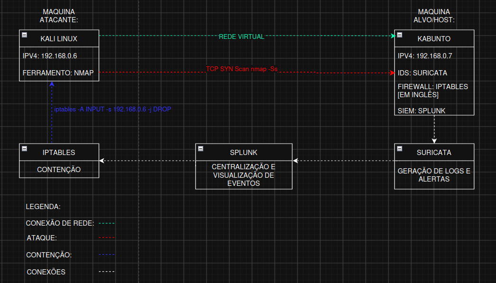

Detecção e Resposta a um TCP SYN Port Scan (Half-Open Scan)

Este projeto demonstra o processo completo de resposta a incidentes baseado no **NIST SP 800-61**, utilizando um ambiente de laboratório controlado para detectar, analisar e responder a um **TCP SYN Port Scan (Half-Open Scan)**.

---

# 📑 Índice

- [Objetivo](#objetivo)
- [Cenário](#cenário)
- [Arquitetura do Laboratório](#arquitetura-do-laboratório)
- [Ferramentas Utilizadas](#ferramentas-utilizadas)
- [Máquina Alvo](#máquina-alvo)
- [Máquina Atacante](#máquina-atacante)
- [Configuração do Splunk](#configuração-do-splunk)
- [Etapa 1 — Preparação](#etapa-1--preparação)
- [Etapa 2 — Detecção-e-Análise](#etapa-2--detecção-e-análise)
- [Etapa 3 — Contenção](#etapa-3--contenção)
- [Etapa 4 — Erradicação](#etapa-4--erradicação)
- [Etapa 5 — Lições Aprendidas](#etapa-5--lições-aprendidas)

---

# Objetivo

Detectar, analisar e responder a um incidente de reconhecimento ativo (**TCP SYN Port Scan**) em um ambiente controlado, aplicando as fases do processo de resposta a incidentes propostas pelo **NIST SP 800-61**.

---

# Cenário

Foi desenvolvido um ambiente de laboratório composto por duas máquinas.

A máquina atacante executou um **TCP SYN Port Scan (Half-Open Scan)** contra um servidor HTTP hospedado na máquina alvo, com o objetivo de identificar portas abertas e serviços disponíveis.

A máquina alvo foi configurada com:

- Suricata HIDS para detecção de atividades suspeitas;
- Splunk Enterprise para centralização e correlação de logs;
- iptables para contenção do incidente após sua confirmação.

---

# Arquitetura do Laboratório



---

# Ferramentas Utilizadas

| Ferramenta | Versão | Finalidade |
|------------|---------|------------|
| Suricata | 7.0.3 | IDS/HIDS |
| Splunk Enterprise | 10.4.0 | SIEM |
| iptables | 1.8 | Firewall |
| Nmap | 7.99 | Reconhecimento de rede |

---

# Máquina Alvo

| Item | Informação |
|------|------------|
| Sistema Operacional | Kubuntu 24.04 LTS |
| Endereço IP | 192.168.0.7 |
| Interface | wlp63s0 |
| Serviço Monitorado | HTTPS |
| Porta | 8080 |

---

# Máquina Atacante

| Item | Informação |
|------|------------|
| Sistema Operacional | Kali Linux |
| Endereço IP | 192.168.0.6 |
| Interface | eth0 |
| Ferramenta | Nmap 7.99 |

---

# Execução do Scan

| Descrição | Comando |
|------------|----------|
| Executar TCP SYN Scan | `sudo nmap -sS 192.168.0.7` |

O parâmetro **-sS** executa um **TCP SYN Scan (Half-Open Scan)**, enviando apenas o pacote SYN para identificar portas abertas sem concluir o Three-Way Handshake.


---

# Configuração do Splunk

O Splunk Enterprise foi configurado para monitorar continuamente o arquivo de logs produzido pelo Suricata.

| Descrição | Caminho Monitorado |
|------------|--------------------|
| Arquivo monitorado | `/var/log/suricata/eve.json` |

Essa configuração permitiu que todos os eventos gerados pelo Suricata fossem automaticamente indexados no índice **main**, possibilitando consultas em tempo real utilizando a linguagem **SPL**.


---

# Etapa 1 — Preparação

Durante a fase de preparação foi criada uma regra personalizada no Suricata para detectar tentativas de **TCP SYN Scan**.

A regra gera um alerta quando um mesmo endereço IP envia uma quantidade elevada de pacotes SYN em um curto intervalo de tempo.

## Regra personalizada do Suricata

```suricata
alert tcp any any -> $HOME_NET any (
    msg:"LAB SCAN - Possivel Nmap SYN Scan";
    flags:S;
    flow:stateless;
    threshold:type both, track by_src, count 3, seconds 5;
    classtype:attempted-recon;
    sid:1000001;
    rev:2;
```

| Descrição | Arquivo |
|------------|----------|
| Regra personalizada | `/etc/suricata/rules/local.rules` |


---

# Etapa 2 — Detecção e Análise

Após a execução do scan, o Suricata identificou a atividade suspeita e registrou o evento no arquivo `eve.json`.

O Splunk Enterprise indexou automaticamente os eventos, permitindo sua consulta por meio da linguagem SPL.

## Consulta SPL

```spl
index=main alert.signature="LAB SCAN - Possivel Nmap SYN Scan"
```

| Descrição | Consulta |
|------------|----------|
| Filtrar alertas do laboratório | `index=main alert.signature="LAB SCAN - Possivel Nmap SYN Scan"` |


---

## Recebimento do Alerta

Após o scan executado pelo Nmap, o Splunk recebeu os eventos enviados pelo Suricata, registrando corretamente a assinatura criada para o laboratório.


---

## Triagem

Durante a análise do incidente foram avaliados os seguintes atributos:

- Endereço IP de origem;
- Endereço IP de destino;
- Assinatura do alerta;
- Horário do evento;
- Quantidade de eventos;
- Portas acessadas;
- Protocolo utilizado.

Foi identificado que todos os eventos estavam relacionados ao mesmo endereço IP de origem.

Após a validação das evidências, o incidente foi classificado como um **Verdadeiro Positivo (True Positive)**.


---

## Classificação de Impacto

| Categoria | Impacto |
|------------|----------|
| Informações | Baixo |
| Disponibilidade | Baixo |
| Funcional | Baixo |
| **Nível de Urgência** | **Baixo** |

### Justificativa

O incidente correspondeu apenas a uma atividade de reconhecimento. Não foram identificadas tentativas de exploração de vulnerabilidades, execução de código malicioso ou comprometimento da máquina alvo.

---

## Indicadores de Comprometimento (IOCs)

| Indicador              | Valor                             |
| ---------------------- | --------------------------------- |
| IP Atacante            | 192.168.0.6                       |
| IP Alvo                | 192.168.0.7                       |
| Ferramenta Utilizada   | Nmap                              |
| Técnica Observada      | TCP SYN Scan                      |
| Porta Monitorada       | 8080                              |
| Assinatura do Suricata | LAB SCAN - Possivel Nmap SYN Scan |

---

# Etapa 3 — Contenção

Após a confirmação do incidente, foi iniciada a fase de contenção com o objetivo de impedir novas tentativas de reconhecimento provenientes da máquina atacante.

Foi aplicada uma regra de firewall utilizando o **iptables**, bloqueando todo o tráfego originado do endereço IP da máquina atacante.

## Aplicação da Regra

| Descrição | Comando |
|------------|----------|
| Bloquear o endereço IP do atacante | `sudo iptables -A INPUT -s 192.168.0.6 -j DROP` |

Essa regra descarta todos os pacotes provenientes do endereço IP **192.168.0.6**, impedindo novas tentativas de reconhecimento contra o servidor monitorado.


---

## Validação da Contenção

Após a aplicação da regra de firewall, um novo **TCP SYN Scan** foi executado a partir da máquina atacante para verificar a eficácia da contenção.

| Descrição | Comando |
|------------|----------|
| Executar novo TCP SYN Scan | `sudo nmap -sS 192.168.0.7` |

O host alvo deixou de responder às tentativas de conexão provenientes do endereço IP bloqueado, confirmando que a contenção foi aplicada com sucesso.


---

# Etapa 4 — Erradicação

Como o incidente consistiu apenas em uma atividade de reconhecimento (**Reconnaissance**) e não houve exploração de vulnerabilidades nem comprometimento do sistema, não foi necessária a remoção de artefatos maliciosos ou a restauração de arquivos.

Ainda assim, foram executadas ações preventivas para fortalecer o ambiente e registrar o incidente.

## Ações Realizadas

- Revisão da regra personalizada do Suricata;
- Validação das regras do firewall;
- Documentação dos Indicadores de Comprometimento (IOCs);
- Armazenamento dos logs para futuras análises;
- Registro do incidente para fins de documentação.

---

## Validação das Regras do Firewall

| Descrição                 | Comando                  |
| ------------------------- | ------------------------ |
| Listar regras do iptables | `sudo iptables -L -n -v` |

---

## Verificação dos Logs do Suricata

| Descrição                      | Comando                                   |
| ------------------------------ | ----------------------------------------- |
| Visualizar eventos registrados | `sudo tail -f /var/log/suricata/eve.json` |

---

## Consulta dos Eventos no Splunk

A consulta SPL utilizada permitiu visualizar apenas os eventos relacionados ao incidente.

```spl
index=main alert.signature="LAB SCAN - Possivel Nmap SYN Scan"
```


---

# Fluxo da Resposta ao Incidente

O processo executado durante o laboratório seguiu as fases recomendadas pelo **NIST SP 800-61**.

| Fase | Status |
|-------|--------|
| Preparação | ✅ Concluída |
| Detecção e Análise | ✅ Concluída |
| Contenção | ✅ Concluída |
| Erradicação | ✅ Concluída |
| Lições Aprendidas | ✅ Concluída |


---

# Evidências Coletadas

Durante o tratamento do incidente foram coletadas evidências suficientes para documentar toda a atividade observada.

| Evidência | Descrição |
|------------|-----------|
| Alerta do Suricata | Identificação do TCP SYN Scan |
| Logs do eve.json | Eventos registrados pelo IDS |
| Eventos do Splunk | Correlação e consulta dos logs |
| Endereço IP de origem | 192.168.0.6 |
| Endereço IP de destino | 192.168.0.7 |
| Porta monitorada | 8080 |
| Assinatura | LAB SCAN - Possivel Nmap SYN Scan |

---

# Lições Aprendidas

O laboratório demonstrou a efetividade da integração entre o **Suricata**, o **Splunk Enterprise** e o **iptables** na identificação e resposta a atividades de reconhecimento.

Também foi possível validar, na prática, todas as fases do processo de resposta a incidentes descritas no **NIST SP 800-61**, desde a preparação até o encerramento do incidente.

Entre os principais aprendizados, destacam-se:

- A importância de um IDS para detectar atividades suspeitas em tempo real;
- O uso de um SIEM para centralizar, correlacionar e consultar eventos de segurança;
- A eficiência do firewall na contenção imediata de atividades maliciosas;
- A relevância da documentação das evidências e dos Indicadores de Comprometimento (IOCs);
- A aplicação de um processo estruturado de resposta a incidentes para reduzir o tempo de detecção e resposta.

---

# Conclusão

Este laboratório demonstrou o ciclo completo de resposta a um incidente de reconhecimento utilizando um ambiente controlado.

A integração entre **Suricata**, **Splunk Enterprise** e **iptables** possibilitou detectar, analisar, conter e documentar um **TCP SYN Port Scan (Half-Open Scan)**, seguindo as boas práticas estabelecidas pelo **NIST SP 800-61**.

Além de reforçar conceitos de monitoramento e resposta a incidentes, o projeto evidencia a importância da correlação de eventos em um SIEM e da aplicação de mecanismos de contenção para reduzir rapidamente a superfície de ataque.

---

# Estrutura do Repositório

```text
Incident-Response-NIST-TCP-SYN-Scan/
│
├── README.md
│
├── images/
│   ├── arquitetura-laboratorio.png
│   ├── nmap-scan.png
│   ├── splunk-monitor.png
│   ├── regra-suricata.png
│   ├── splunk-consulta.png
│   ├── alerta-splunk.png
│   ├── eventos-splunk.png
│   ├── iocs.png
│   ├── iptables-block.png
│   ├── nmap-after-block.png
│   ├── iptables-list.png
│   ├── eve-json.png
│   ├── splunk-final.png
│   ├── nist-process.png
│   └── evidencias.png
│
└── rules/
    └── local.rules
```

---

# Referências

- National Institute of Standards and Technology (NIST). **Computer Security Incident Handling Guide (SP 800-61 Revision 2)**.
- Suricata IDS Documentation.
- Splunk Enterprise Documentation.
- Nmap Reference Guide.
- iptables Manual.
